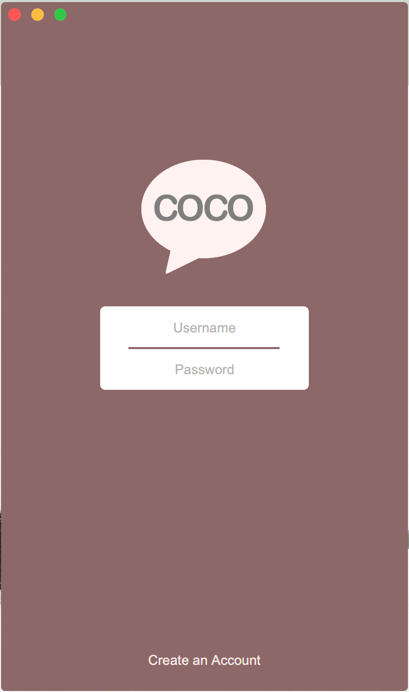
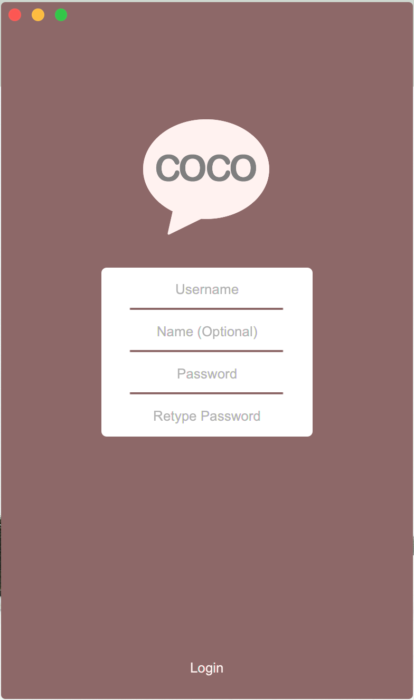
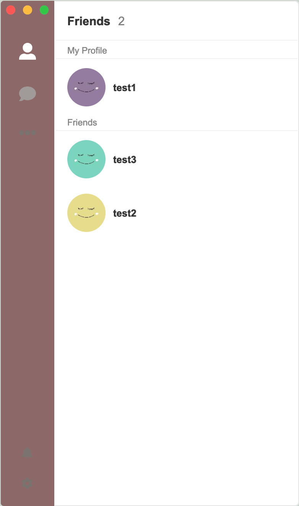
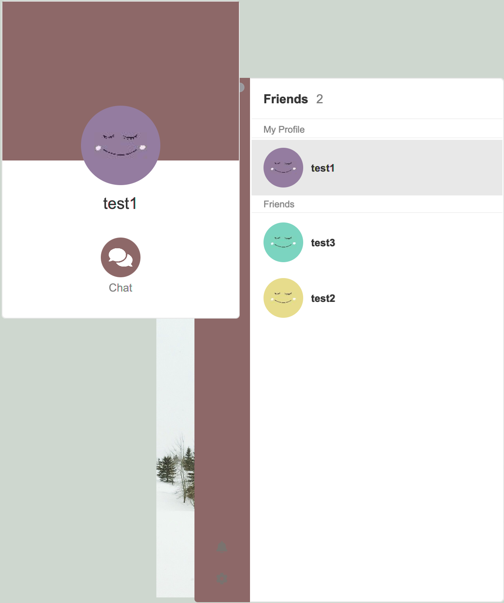
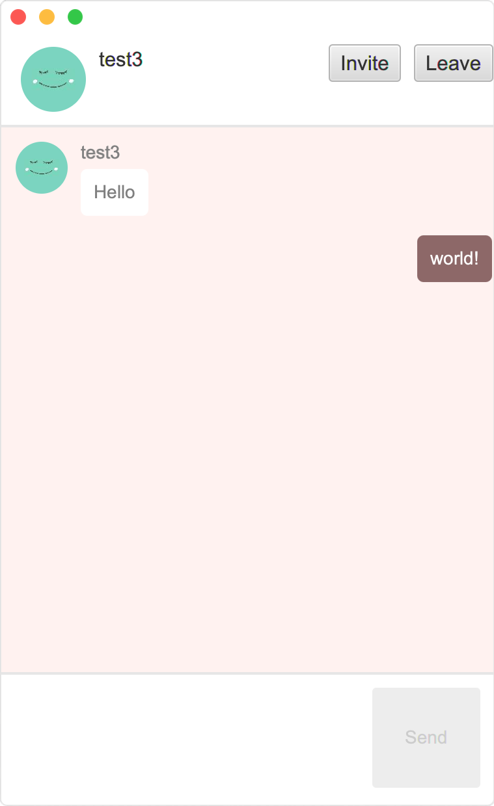

# CocoWhisper (CURRENTLY WIP)

## Description
An XMPP client built using Java and JavaFX for the GUI. The XMPP connection is done with the Smack API.

NOTE! This application is heavily WIP and is lacking many XEP features. This is a side project I'm working on and updates may be sparse at times.

## Setup (As of 2019-01-18)
I don't recommend setting it up right now because the code is super unorganized. I will post a proper setup guide once I organize and comment the code.

If you still wish to set it up and play around with it, feel free to do so.

## Pictures
<h3>Login & Register</h3>

    
        
    
    
        
    

<h3>Friends List</h3>

    
        
    

<h3>Friends' Info</h3>

    
        
    

<h3>Chatroom</h3>

    
        
    

## Contact
Please feel free to contact me at bchong@uw.edu!